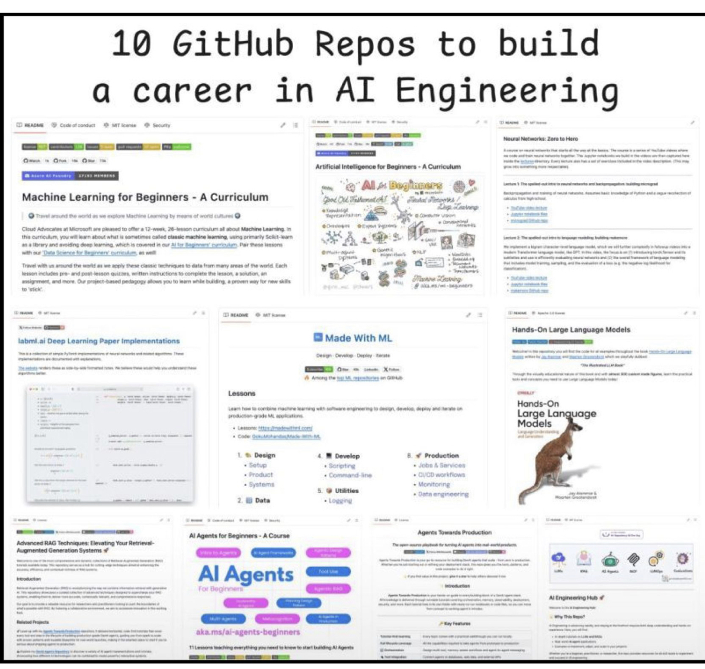

# 10 Ai Repos

> **Document Analysis:** This document has been processed through the enhanced ingest workflow with UML glossary integration and classified as a **conceptual** type (general subtype).

## Document Overview

**Source:** 10_ai_repos.jpg  
**Processed:** 2026-01-30 05:22:20  
**Git SHA:** a1e3cd6a168ef4053064feb0d008d9776799fd73  
**UUID7:** a6f8e8d  
**Word Count:** 27 words  
**Main Sections:**   
**UML Classification:** conceptual (general)  

## Visual Resources

### 🎯 UML Diagram
**Type:** Conceptual Overview  
**Subtype:** general  
**File:** [10_Ai_Repos__conceptual__a6f8e8d.puml](doc/uml/10_Ai_Repos__conceptual__a6f8e8d.puml)

The UML diagram has been generated using enhanced analysis with UML glossary knowledge, providing accurate visualization of the conceptual concept described in this document.

### 📋 Technical Summary
**File:** [10_Ai_Repos__a6f8e8d.md](doc/skills/10_Ai_Repos__a6f8e8d.md)

The technical summary contains structured metadata, key insights, and AI-optimized content with UML context for automated processing.

### 📚 UML Glossary
**Reference:** [skills/uml-glossary.md](skills/uml-glossary.md)

The comprehensive UML glossary provides definitions and explanations of UML concepts, relationships, and diagram types used in this analysis.

## Key Concepts
- **GitHub**
    - **Repos**
    - **Engineering**
    - **Soe**
    - **Cm**
    - **Ons**
    - **Ome**
    - **Machine**
    - **Learning**
    - **Beginners**
    - **Curriculum**

## Main Takeaways

## UML Analysis Notes

This document was processed using UML glossary knowledge, enabling:
- Accurate diagram type classification
- Enhanced understanding of UML terminology
- Improved visualization based on UML standards
- Better context for technical documentation

## Original Image

    

    ## OCR Extracted Text

---

10 GitHub Repos to build a career in AI Engineering Soe as a Cm © Ons) © Ome hy Machine Learning for Beginners - A Curriculum °
