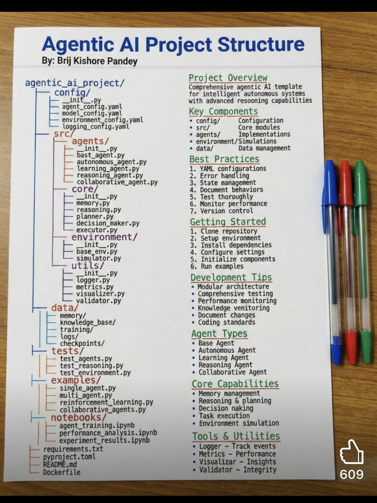

# Agenticaiproject

> **Document Analysis:** This document has been processed through the enhanced ingest workflow with UML glossary integration and classified as a **component** type (structural subtype).

## Document Overview

**Source:** AgenticAiProject.jpg  
**Processed:** 2026-01-30 05:22:21  
**Git SHA:** a1e3cd6a168ef4053064feb0d008d9776799fd73  
**UUID7:** 82130b7  
**Word Count:** 258 words  
**Main Sections:**   
**UML Classification:** component (structural)  

## Visual Resources

### 🎯 UML Diagram
**Type:** Component Diagram  
**Subtype:** structural  
**File:** [Agenticaiproject__component__82130b7.puml](doc/uml/Agenticaiproject__component__82130b7.puml)

The UML diagram has been generated using enhanced analysis with UML glossary knowledge, providing accurate visualization of the component concept described in this document.

### 📋 Technical Summary
**File:** [Agenticaiproject__82130b7.md](doc/skills/Agenticaiproject__82130b7.md)

The technical summary contains structured metadata, key insights, and AI-optimized content with UML context for automated processing.

### 📚 UML Glossary
**Reference:** [skills/uml-glossary.md](skills/uml-glossary.md)

The comprehensive UML glossary provides definitions and explanations of UML concepts, relationships, and diagram types used in this analysis.

## Key Concepts
- **Agentic**
    - **Al**
    - **Project**
    - **Structure**
    - **By**
    - **Brij**
    - **Kishore**
    - **Pandey**
    - **Med**
    - **Dockerfile**
    - **Overview**
    - **Comprehensive**
    - **Key**
    - **Components**
    - **Configuration**
    - **Core**
    - **Implementations**
    - **Simulations**
    - **Data**
    - **Best**
    - **Practices**
    - **Error**
    - **State**
    - **Document**
    - **Test**
    - **Monitor**
    - **Version**
    - **Getting**
    - **Started**
    - **Clone**
    - **Setup**
    - **Install**
    - **Configure**
    - **Initialize**
    - **Run**
    - **Development**
    - **Tips**
    - **Modular**
    - **Performance**
    - **Knowledge**
    - **Coding**
    - **Agent**
    - **Types**
    - **Base**
    - **Autonomous**
    - **Learning**
    - **Reasoning**
    - **Collaborative**
    - **Capabilities**
    - **Memory**
    - **Decision**
    - **Task**
    - **Environment**
    - **Tools**
    - **Utilities**
    - **Logger**
    - **Track**
    - **Metrics**
    - **Visualizar**
    - **Insights**
    - **Validator**
    - **Integrity**

## Main Takeaways

## UML Analysis Notes

This document was processed using UML glossary knowledge, enabling:
- Accurate diagram type classification
- Enhanced understanding of UML terminology
- Improved visualization based on UML standards
- Better context for technical documentation

## Original Image

    

    ## OCR Extracted Text

---

Agentic Al Project Structure By: Brij Kishore Pandey agentic_ai_project/ ~ ee oy | ini f— agent_ contig. yam\ = model_config. yaml = environment_config. yaml logging_config.yaml ——— ae t+— agents/ }— — init_. -— bast_agent.py }+— autonomous_agent.py learning_agent.py +— reasoning_agent.py - collaborative_agent.py core/ +— __init_.py /— memory. py — reasoning. py — ~ planner. py - decision_maker.py - executor. py environment/ metrics.py visualizer. py —- validator.py - data/ memory/ knowledge_base/ training/ logs/ , checkpoints/ t— tests/ | E test_agents. py test_reasoning. py test_environment.py — examples/ | |— single_agent.py multi_agent. py E reinforcement_learning. py rela »_agents.py |— notebooks/ agent_training.ipynb performance_analysis. mi Med experiment_results. ipyn requirements.txt project. toml snd Dockerfile Project Overview Comprehensive agentic AI template for intelligent autonomous systems with advanced resooning capabilities Key Components * config/ Configuration * src/ Core modules * agents/ Implementations * environment/ Simulations + data/ Data management Best Practices 1. YAML configurations 2. Error handling 3. State management 4. Document behaviors 5. Test thoroughly 6. Monitor performance ‘3 Version control Getting Started « Clone repository + Setup environment » Install dependencies . Configure settings . Initialize components » Run examples Development Tips ¢ Modular architecture * Comprehensive testing ¢ Performance monitoring * Knowledge venitoring * Document changes * Coding standards Agent Types « Base Agent * Autonomous Agent * Learning Agent * Reasoning Agent * Collaborative Agent Core Capabilities * Memory management ¢ Reasoning & planning * Decision naking * Task execution * Environment simulation Tools & Utilities ¢ Logger - Track t . Metrics = parforssice * Visualizar - Insights * Validator - Integrity
