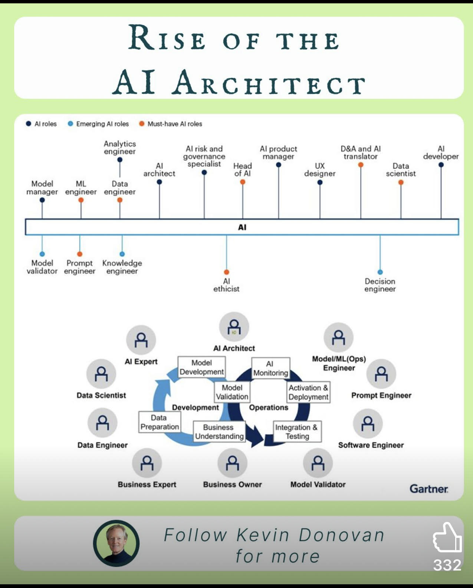

# Aiarchitect

> **Document Analysis:** This document has been processed through the enhanced ingest workflow with UML glossary integration and classified as a **conceptual** type (general subtype).

## Document Overview

**Source:** AiArchitect.jpg  
**Processed:** 2026-01-30 05:22:22  
**Git SHA:** a1e3cd6a168ef4053064feb0d008d9776799fd73  
**UUID7:** d6a5d75  
**Word Count:** 67 words  
**Main Sections:**   
**UML Classification:** conceptual (general)  

## Visual Resources

### 🎯 UML Diagram
**Type:** Conceptual Overview  
**Subtype:** general  
**File:** [Aiarchitect__conceptual__d6a5d75.puml](doc/uml/Aiarchitect__conceptual__d6a5d75.puml)

The UML diagram has been generated using enhanced analysis with UML glossary knowledge, providing accurate visualization of the conceptual concept described in this document.

### 📋 Technical Summary
**File:** [Aiarchitect__d6a5d75.md](doc/skills/Aiarchitect__d6a5d75.md)

The technical summary contains structured metadata, key insights, and AI-optimized content with UML context for automated processing.

### 📚 UML Glossary
**Reference:** [skills/uml-glossary.md](skills/uml-glossary.md)

The comprehensive UML glossary provides definitions and explanations of UML concepts, relationships, and diagram types used in this analysis.

## Key Concepts
- **Alroles**
    - **EmergingAl**
    - **Must**
    - **Al**
    - **Analvice**
    - **Head**
    - **Data**
    - **Model**
    - **Prompt**
    - **Knowledge**
    - **Decision**
    - **Architect**
    - **Scientist**
    - **Engineer**

## Main Takeaways

## UML Analysis Notes

This document was processed using UML glossary knowledge, enabling:
- Accurate diagram type classification
- Enhanced understanding of UML terminology
- Improved visualization based on UML standards
- Better context for technical documentation

## Original Image

    

    ## OCR Extracted Text

---

RISE OF THE AI ARCHITECT @ Alroles © EmergingAl roles @ Must-have Al roles Analvice Al risk and Al product D&A and Al Al governance manager translator developer i Al specialist Head UX Data architect of Al designer scientist Model ML Data manager engineer engineer Model Prompt Knowledge validator engineer engineer Al Decision ethicist engineer 9, a 9, Al Architect Data Scientist Data Engineer a a a
