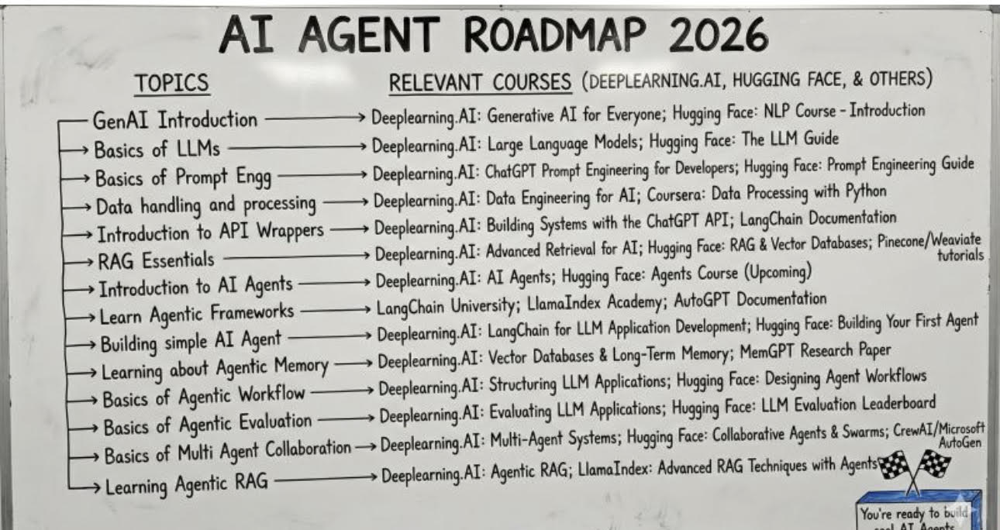

# Airoadmap

> **Document Analysis:** This document has been processed through the enhanced ingest workflow with UML glossary integration and classified as a **activity** type (behavioral subtype).

## Document Overview

**Source:** AiRoadmap.jpg  
**Processed:** 2026-01-30 05:22:22  
**Git SHA:** a1e3cd6a168ef4053064feb0d008d9776799fd73  
**UUID7:** 68510d9  
**Word Count:** 209 words  
**Main Sections:**   
**UML Classification:** activity (behavioral)  

## Visual Resources

### 🎯 UML Diagram
**Type:** Activity Diagram  
**Subtype:** behavioral  
**File:** [Airoadmap__activity__68510d9.puml](doc/uml/Airoadmap__activity__68510d9.puml)

The UML diagram has been generated using enhanced analysis with UML glossary knowledge, providing accurate visualization of the activity concept described in this document.

### 📋 Technical Summary
**File:** [Airoadmap__68510d9.md](doc/skills/Airoadmap__68510d9.md)

The technical summary contains structured metadata, key insights, and AI-optimized content with UML context for automated processing.

### 📚 UML Glossary
**Reference:** [skills/uml-glossary.md](skills/uml-glossary.md)

The comprehensive UML glossary provides definitions and explanations of UML concepts, relationships, and diagram types used in this analysis.

## Key Concepts
- **Introduction**
    - **Deeplearning**
    - **Generative**
    - **Everyone**
    - **Hugging**
    - **Face**
    - **Course**
    - **Basics**
    - **Large**
    - **Language**
    - **Models**
    - **The**
    - **Guide**
    - **Prompt**
    - **Engg**
    - **Engineering**
    - **Developers**
    - **Data**
    - **Coursera**
    - **Processing**
    - **Python**
    - **Wrappers**
    - **Building**
    - **Systems**
    - **LangChain**
    - **Documentation**
    - **Essentials**
    - **Advanced**
    - **Retrieval**
    - **Vector**
    - **Databases**
    - **Pinecone**
    - **Wenviate**
    - **Agents**
    - **Upcoming**
    - **Learn**
    - **Agentic**
    - **Frameworks**
    - **University**
    - **Llamalndex**
    - **Academy**
    - **Agent**
    - **Application**
    - **Development**
    - **Your**
    - **First**
    - **Learning**
    - **Memory**
    - **Long**
    - **Term**
    - **Research**
    - **Paper**
    - **Workflow**
    - **Structuring**
    - **Applications**
    - **Designing**
    - **Workflows**
    - **Evaluation**
    - **Evaluating**
    - **Leaderboard**
    - **Multi**
    - **Collaboration**
    - **Collaborative**
    - **Swarms**
    - **CrewAl**
    - **Micresft**
    - **LlamaIndex**
    - **Techniques**

## Main Takeaways

## UML Analysis Notes

This document was processed using UML glossary knowledge, enabling:
- Accurate diagram type classification
- Enhanced understanding of UML terminology
- Improved visualization based on UML standards
- Better context for technical documentation

## Original Image

    

    ## OCR Extracted Text

---

‘AI AGENT ROADMAP 2026 3=—S TOPICS RELEVANT COURSES (DEEPLEARNING.AI, HUGGING FACE, & OTHERS) GenAL Introduction —————> Deeplearning. AI: Generative AI for Everyone; Hugging Face: NLP Course - Introduction Basics of LLMs Deeplearning.AI: Large Language Models; Hugging Face: The LLM Guide Basics of Prompt Engg Deeplearning.AI: ChatGPT Prompt Engineering for Developers; Hugging Face: Prompt Engineering Guide Data handling and processing —— Deeplearning.AL: Data Engineering for AI; Coursera: Data Processing with Python Introduction to API Wrappers —> Deeplearning.AI: Building Systems with the ChatGPT API; LangChain Documentation RAG Essentials Deeplearning.AI: Advanced Retrieval for AT; Hugging Face: RAG & Vector Databases; Pinecone/Wenviate Introduction to AI Agents Deeplearning.AI: AI Agents; Hugging Face: Agents Course (Upcoming) , Learn Agentic Frameworks LangChain University; Llamalndex Academy; AutoGPT Documentation Building simple AL Agent ———— Deeplearning.AI: LangChain for LLM Application Development; Hugging Face: Building Your First Agent Learning about Agentic Memory —> Deeplearning.AI: Vector Databases & Long-Term Memory; MemGPT Research Paper Basics of Agentic Workflow ——— Deeplearning.AL: Structuring LLM Applications; Hugging Face: Designing Agent Workflows Basics of Agentic Evaluation ——> Deeplearning.AI: Evaluating LLM Applications; Hugging Face: LLM Evaluation Leaderboard Basics of Multi Agent Collaboration —> Deeplearning.AI: Multi-Agent Systems; Hugging Face: Collaborative Agents & Swarms; CrewAl/Micresft Learning Agentic RAG ————— Deeplearning AI: Agentic RAG; LlamaIndex: Advanced RAG Techniques with Agents!
