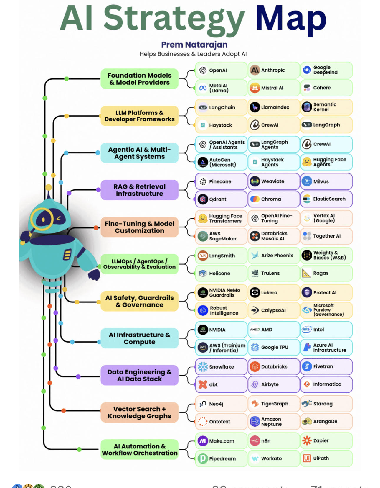

# Aistrategymap

> **Document Analysis:** This document has been processed through the enhanced ingest workflow with UML glossary integration and classified as a **conceptual** type (general subtype).

## Document Overview

**Source:** AiStrategyMap.jpg  
**Processed:** 2026-01-30 05:22:23  
**Git SHA:** a1e3cd6a168ef4053064feb0d008d9776799fd73  
**UUID7:** ceffff1  
**Word Count:** 146 words  
**Main Sections:**   
**UML Classification:** conceptual (general)  

## Visual Resources

### 🎯 UML Diagram
**Type:** Conceptual Overview  
**Subtype:** general  
**File:** [Aistrategymap__conceptual__ceffff1.puml](doc/uml/Aistrategymap__conceptual__ceffff1.puml)

The UML diagram has been generated using enhanced analysis with UML glossary knowledge, providing accurate visualization of the conceptual concept described in this document.

### 📋 Technical Summary
**File:** [Aistrategymap__ceffff1.md](doc/skills/Aistrategymap__ceffff1.md)

The technical summary contains structured metadata, key insights, and AI-optimized content with UML context for automated processing.

### 📚 UML Glossary
**Reference:** [skills/uml-glossary.md](skills/uml-glossary.md)

The comprehensive UML glossary provides definitions and explanations of UML concepts, relationships, and diagram types used in this analysis.

## Key Concepts
- **Al**
    - **Strategy**
    - **Prem**
    - **Natarajan**
    - **Helps**
    - **Businesses**
    - **Leaders**
    - **Adopt**
    - **Queer**
    - **Langchain**
    - **Quemainaer**
    - **Ox**
    - **Fabled**
    - **Agentic**
    - **Multi**
    - **AutoGen**
    - **Haystack**
    - **Hugging**
    - **Face**
    - **Agents**
    - **Pinecone**
    - **Weaviate**
    - **Milvus**
    - **Opens**
    - **Fine**
    - **Databricks**
    - **Together**
    - **Weights**
    - **Langsmith**
    - **Arize**
    - **Phoenix**
    - **Helicone**
    - **Trutens**
    - **Ds**
    - **Ragas**
    - **Se**
    - **Owe**
    - **Desens**
    - **Intel**
    - **Spear**
    - **Neoaj**
    - **TigerGraph**
    - **Stardog**
    - **Monti**
    - **Qwerscom**
    - **Qn**
    - **Workato**
    - **Ui**
    - **Zed**

## Main Takeaways

## UML Analysis Notes

This document was processed using UML glossary knowledge, enabling:
- Accurate diagram type classification
- Enhanced understanding of UML terminology
- Improved visualization based on UML standards
- Better context for technical documentation

## Original Image

    

    ## OCR Extracted Text

---

Al Strategy — Prem Natarajan Helps Businesses & Leaders Adopt Al in (ane) | Queer \$ © cohere © Langchain | Quemainaer Ox Fabled a woystack — @erewar EB tangoropn Agentic Al & Multi- 6 preacager | ex tengeroeh aC) crewal sd AutoGen o Haystack Hugging Face Agents Agents ~ £8 Pinecone \ Weaviate i Milvus = a Hugging F “@ Opens Fine- lertex A @ ramos © toring | ecog AWS Databricks @ isis ver RoeGivAL j Together Al f ( Weights& © Langsmith > Arize Phoenix @ bade (wes) © Helicone @ Trutens ‘Ds Ragas Se a ° ane Owe. Desens — ORE e NVIDIA \~ AMD je Intel Spear | 2 eooaerry | AeA ce | 31 Neoaj ® TigerGraph 1s Stardog 2s ontotext Monti _@®) srangove Qwerscom Qn HE zapier (@pripedream — Workato [Ui] uiatn Zed ih ~a rr ~rm . —
