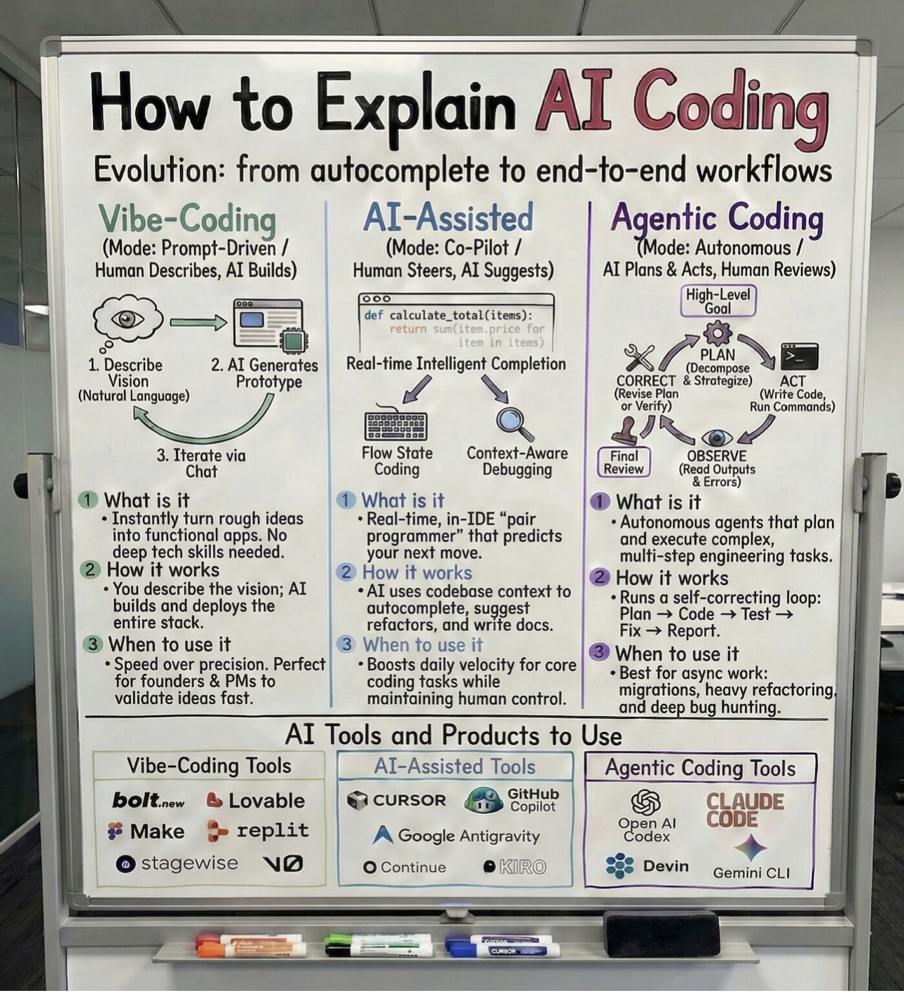

# Explainaicoding

> **Document Analysis:** This document has been processed through the enhanced ingest workflow with UML glossary integration and classified as a **activity** type (behavioral subtype).

## Document Overview

**Source:** ExplainAiCoding.jpg  
**Processed:** 2026-01-30 05:22:24  
**Git SHA:** a1e3cd6a168ef4053064feb0d008d9776799fd73  
**UUID7:** 810f1cc  
**Word Count:** 294 words  
**Main Sections:**   
**UML Classification:** activity (behavioral)  

## Visual Resources

### 🎯 UML Diagram
**Type:** Activity Diagram  
**Subtype:** behavioral  
**File:** [Explainaicoding__activity__810f1cc.puml](doc/uml/Explainaicoding__activity__810f1cc.puml)

The UML diagram has been generated using enhanced analysis with UML glossary knowledge, providing accurate visualization of the activity concept described in this document.

### 📋 Technical Summary
**File:** [Explainaicoding__810f1cc.md](doc/skills/Explainaicoding__810f1cc.md)

The technical summary contains structured metadata, key insights, and AI-optimized content with UML context for automated processing.

### 📚 UML Glossary
**Reference:** [skills/uml-glossary.md](skills/uml-glossary.md)

The comprehensive UML glossary provides definitions and explanations of UML concepts, relationships, and diagram types used in this analysis.

## Key Concepts
- **Vibe**
    - **Coding**
    - **Mode**
    - **Prompt**
    - **Driven**
    - **Human**
    - **Describes**
    - **Builds**
    - **Generates**
    - **Describe**
    - **Prototype**
    - **Natural**
    - **Language**
    - **Iterate**
    - **Chat**
    - **What**
    - **Instantly**
    - **No**
    - **How**
    - **You**
    - **When**
    - **Speed**
    - **Perfect**
    - **Tools**
    - **Explain**
    - **Evolution**
    - **Products**
    - **Use**
    - **Al**
    - **Assisted**
    - **Agentic**
    - **Co**
    - **Pilot**
    - **Steers**
    - **Suggests**
    - **Autonomous**
    - **Plans**
    - **Acts**
    - **Reviews**
    - **High**
    - **Level**
    - **Real**
    - **Intelligent**
    - **Completion**
    - **Cc**
    - **Ny**
    - **Strat**
    - **Strategize**
    - **Revise**
    - **Plan**
    - **Write**
    - **Code**
    - **Run**
    - **Commands**
    - **Flow**
    - **State**
    - **Context**
    - **Aware**
    - **Final**
    - **Debugging**
    - **Review**
    - **Boosts**
    - **Runs**
    - **Test**
    - **Fix**
    - **Report**
    - **Best**
    - **Lovable**
    - **Make**
    - **Ostagewise**
    - **GitHub**
    - **Gcursor**
    - **Sthut**
    - **Google**
    - **Antigravity**
    - **Continue**
    - **Open**
    - **Devin**
    - **Gemini**

## Main Takeaways

## UML Analysis Notes

This document was processed using UML glossary knowledge, enabling:
- Accurate diagram type classification
- Enhanced understanding of UML terminology
- Improved visualization based on UML standards
- Better context for technical documentation

## Original Image

    

    ## OCR Extracted Text

---

Vibe-Coding (Mode: Prompt-Driven / Human Describes, AI Builds) © 2. AT Generates 1. Describe isi Prototype ision (Natural Language) 1 3. Iterate via j Chat HI) | a | ® What is it + Instantly turn rough ideas into functional apps. No deep tech skills needed. @ How it works + You describe the vision; AI builds and deploys the entire stack. 3) When to use it * Speed over precision. Perfect for founders & PMs to validate ideas fast. |__ Vibe-Coding Tools How to Explain AI Coding Evolution: from autocomplete to end-to-end workflows AI Tools and Products to Use Al-Assisted Tools __} [_ Agentic Coding Tools AI-Assisted (Mode: Co-Pilot / Human Steers, AI Suggests) sat Coding lode: Autonomous / , Al Plans & Acts, Human Reviews) | High-Level def calculate_total (items): e io Real-time Intelligent Completion 3 Cc Ny P 4 NX Strat pos CORRECT &Strategize) ACT (Revise Plan (Write Code, ify) Run Commands) Flow State Context-Aware Final OBSERVE Coding Debugging Review (od ot rrors, 1 What is it @ What is it Real-time, in-IDE “pair programmer” that predicts your next move. 2) How it works + AI uses codebase context to autocomplete, suggest refactors, and write docs. 3 When to use it * Boosts daily velocity for core coding tasks while maintaining human control. | + Autonomous agents that plan and execute complex, multi-step engineering tasks. 2 How it works Runs a self-correcting loop: Plan > Code > Test > Fix > Report. S When to use it + Best for async work: migrations, heavy refactoring) and deep bug hunting. bolt. & Lovable |#Make @& replit | Ostagewise NO ies GitHub Gcursor GB Sthut A Google Antigravity | O Continue @KIRO CLAUDE CODE Open Al codex ese i eg° Devin Gemini CLI
