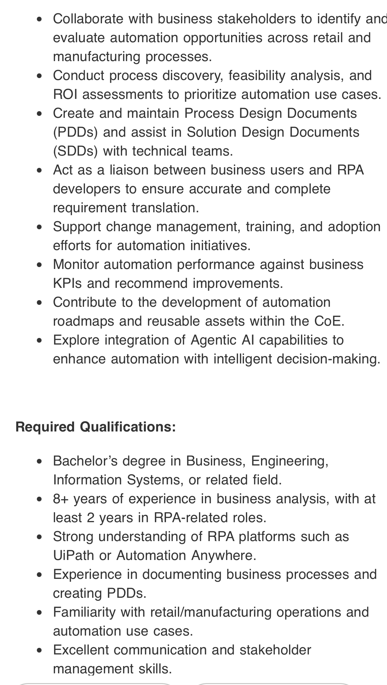

# Jobdescription

> **Document Analysis:** This document has been processed through the enhanced ingest workflow with UML glossary integration and classified as a **activity** type (behavioral subtype).

## Document Overview

**Source:** JobDescription.jpg  
**Processed:** 2026-01-30 05:22:24  
**Git SHA:** a1e3cd6a168ef4053064feb0d008d9776799fd73  
**UUID7:** 5a158c9  
**Word Count:** 180 words  
**Main Sections:**   
**UML Classification:** activity (behavioral)  

## Visual Resources

### 🎯 UML Diagram
**Type:** Activity Diagram  
**Subtype:** behavioral  
**File:** [Jobdescription__activity__5a158c9.puml](doc/uml/Jobdescription__activity__5a158c9.puml)

The UML diagram has been generated using enhanced analysis with UML glossary knowledge, providing accurate visualization of the activity concept described in this document.

### 📋 Technical Summary
**File:** [Jobdescription__5a158c9.md](doc/skills/Jobdescription__5a158c9.md)

The technical summary contains structured metadata, key insights, and AI-optimized content with UML context for automated processing.

### 📚 UML Glossary
**Reference:** [skills/uml-glossary.md](skills/uml-glossary.md)

The comprehensive UML glossary provides definitions and explanations of UML concepts, relationships, and diagram types used in this analysis.

## Key Concepts
- **Collaborate**
    - **Conduct**
    - **Create**
    - **Process**
    - **Design**
    - **Documents**
    - **Solution**
    - **Act**
    - **Support**
    - **Monitor**
    - **Contribute**
    - **Explore**
    - **Agentic**
    - **Al**
    - **Required**
    - **Qualifications**
    - **Bachelor**
    - **Business**
    - **Engineering**
    - **Information**
    - **Systems**
    - **Strong**
    - **UiPath**
    - **Automation**
    - **Anywhere**
    - **Experience**
    - **Familiarity**
    - **Excellent**

## Main Takeaways

## UML Analysis Notes

This document was processed using UML glossary knowledge, enabling:
- Accurate diagram type classification
- Enhanced understanding of UML terminology
- Improved visualization based on UML standards
- Better context for technical documentation

## Original Image

    

    ## OCR Extracted Text

---

e Collaborate with business stakeholders to identify anc evaluate automation opportunities across retail and manufacturing processes. e Conduct process discovery, feasibility analysis, and ROI assessments to prioritize automation use cases. e Create and maintain Process Design Documents (PDDs) and assist in Solution Design Documents (SDDs) with technical teams. e Act as a liaison between business users and RPA developers to ensure accurate and complete requirement translation. e Support change management, training, and adoption efforts for automation initiatives. e Monitor automation performance against business KPls and recommend improvements. e Contribute to the development of automation roadmaps and reusable assets within the CoE. e Explore integration of Agentic Al capabilities to enhance automation with intelligent decision-making. Required Qualifications: e Bachelor’s degree in Business, Engineering, Information Systems, or related field. e 8+ years of experience in business analysis, with at least 2 years in RPA-related roles. e Strong understanding of RPA platforms such as UiPath or Automation Anywhere. e Experience in documenting business processes and creating PDDs. e Familiarity with retail/manufacturing operations and automation use cases. e Excellent communication and stakeholder management skills.
