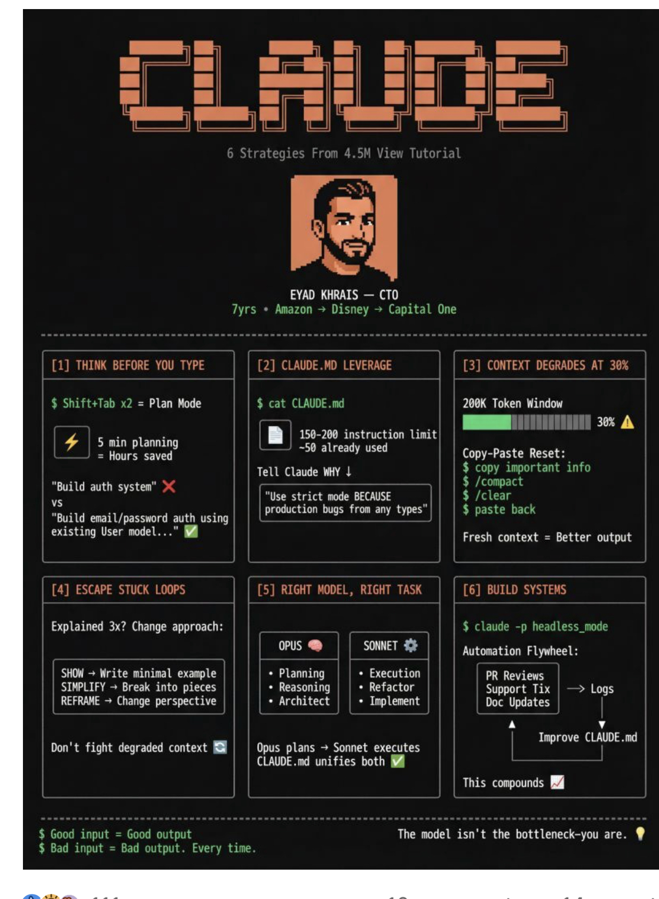

# Modeltotask

> **Document Analysis:** This document has been processed through the enhanced ingest workflow with UML glossary integration and classified as a **conceptual** type (general subtype).

## Document Overview

**Source:** ModelToTask.jpg  
**Processed:** 2026-01-30 05:22:25  
**Git SHA:** a1e3cd6a168ef4053064feb0d008d9776799fd73  
**UUID7:** 6fcc91f  
**Word Count:** 254 words  
**Main Sections:**   
**UML Classification:** conceptual (general)  

## Visual Resources

### 🎯 UML Diagram
**Type:** Conceptual Overview  
**Subtype:** general  
**File:** [Modeltotask__conceptual__6fcc91f.puml](doc/uml/Modeltotask__conceptual__6fcc91f.puml)

The UML diagram has been generated using enhanced analysis with UML glossary knowledge, providing accurate visualization of the conceptual concept described in this document.

### 📋 Technical Summary
**File:** [Modeltotask__6fcc91f.md](doc/skills/Modeltotask__6fcc91f.md)

The technical summary contains structured metadata, key insights, and AI-optimized content with UML context for automated processing.

### 📚 UML Glossary
**Reference:** [skills/uml-glossary.md](skills/uml-glossary.md)

The comprehensive UML glossary provides definitions and explanations of UML concepts, relationships, and diagram types used in this analysis.

## Key Concepts
- **Ei**
    - **Strategies**
    - **From**
    - **View**
    - **Tutorial**
    - **Na**
    - **Amazon**
    - **Disney**
    - **Capital**
    - **One**
    - **Shift**
    - **Tab**
    - **Plan**
    - **Mode**
    - **Token**
    - **Window**
    - **Limit**
    - **Hours**
    - **Copy**
    - **Paste**
    - **Reset**
    - **Tell**
    - **Claude**
    - **Build**
    - **Mi**
    - **Lt**
    - **Hani**
    - **User**
    - **Fresh**
    - **Better**
    - **Explained**
    - **Change**
    - **Opus**
    - **Automation**
    - **Flywheel**
    - **Write**
    - **Planning**
    - **Execution**
    - **Reviews**
    - **Break**
    - **Reasoning**
    - **Refactor**
    - **Support**
    - **Tix**
    - **Logs**
    - **Architect**
    - **Implement**
    - **Doc**
    - **Updates**
    - **Improve**
    - **Don**
    - **Sonnet**
    - **This**
    - **Good**
    - **The**
    - **Bad**
    - **Every**

## Main Takeaways

## UML Analysis Notes

This document was processed using UML glossary knowledge, enabling:
- Accurate diagram type classification
- Enhanced understanding of UML terminology
- Improved visualization based on UML standards
- Better context for technical documentation

## Original Image

    

    ## OCR Extracted Text

---

va fers ae a Ei | =| 6 Strategies From 4.5M View Tutorial —N i Na EYAD KHRAIS — CTO 7yrs * Amazon > Disney > Capital One [1] THINK BEFORE YOU TYPE 2] CLAUDE.MD LEVERAGE [3] CONTEXT DEGRADES AT 30% | | $ Shift+Tab x2 = Plan Mode | | $ cat CLAUDE.md 200K Token Window | — MLA AAEAINN 30% 4 5 pin planning =| 150-200 instruction Limit | L” J = Hours saved ~50 already used | | Copy-Paste Reset: | | | Tell Claude WHY | $ copy important info | "Build auth system" >¢ ire E ) $ /compact | vs i BS (oe as ae $ basa? : “Build email/password auth using shies nd cil Mi lel Lt Hani hs existing User model..." 9 | | Fresh context = Better output [4] ESCAPE STUCK LOOPS | [5] RIGHT MODEL, RIGHT TASK [6] BUILD SYSTEMS Explained 3x? Change approach: | $ claude -p headless_mode Opus @® i] SONNET | Automation Flywheel: | | SHOW > Write minimal example * Planning + Execution PR Reviews | | SIMPLIFY > Break into pieces + Reasoning + Refactor Support Tix | —> Logs REFRAME ~ Change perspective | + Architect | | + Implement Doc Updates | a vy | | Improve CLAUDE.md Don't fight degraded context | | Opus plans > Sonnet executes | | CLAUDE.md unifies both This compounds $ Good input = Good output The model isn't the bottleneck-you are. @ $ Bad input = Bad output. Every time.
