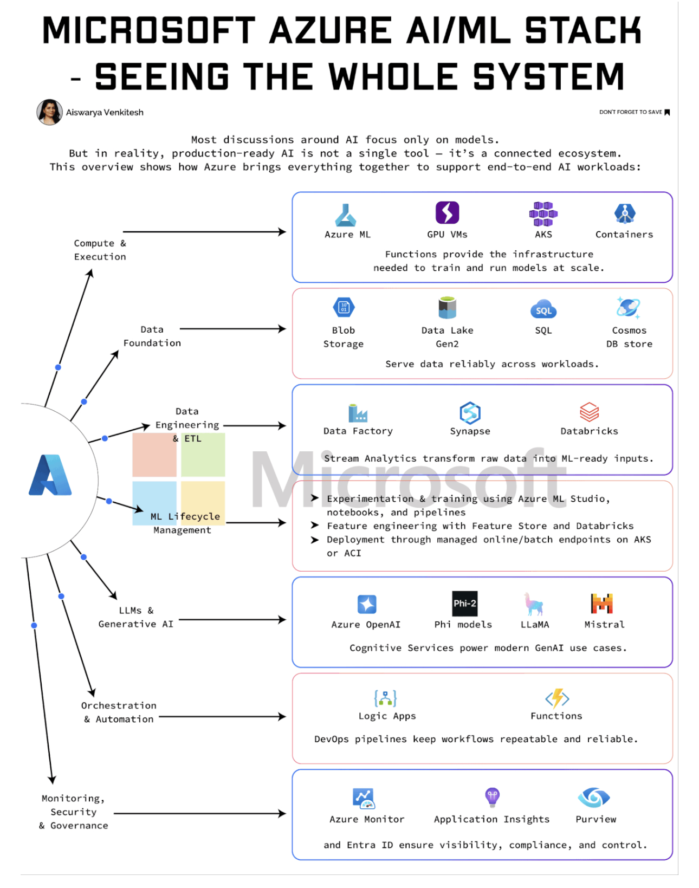

# Msstack

> **Document Analysis:** This document has been processed through the enhanced ingest workflow with UML glossary integration and classified as a **activity** type (behavioral subtype).

## Document Overview

**Source:** MsStack.jpg  
**Processed:** 2026-01-30 05:22:25  
**Git SHA:** a1e3cd6a168ef4053064feb0d008d9776799fd73  
**UUID7:** 7a58b98  
**Word Count:** 208 words  
**Main Sections:**   
**UML Classification:** activity (behavioral)  

## Visual Resources

### 🎯 UML Diagram
**Type:** Activity Diagram  
**Subtype:** behavioral  
**File:** [Msstack__activity__7a58b98.puml](doc/uml/Msstack__activity__7a58b98.puml)

The UML diagram has been generated using enhanced analysis with UML glossary knowledge, providing accurate visualization of the activity concept described in this document.

### 📋 Technical Summary
**File:** [Msstack__7a58b98.md](doc/skills/Msstack__7a58b98.md)

The technical summary contains structured metadata, key insights, and AI-optimized content with UML context for automated processing.

### 📚 UML Glossary
**Reference:** [skills/uml-glossary.md](skills/uml-glossary.md)

The comprehensive UML glossary provides definitions and explanations of UML concepts, relationships, and diagram types used in this analysis.

## Key Concepts
- **Al**
    - **Most**
    - **But**
    - **This**
    - **Azure**
    - **Ty**
    - **Containers**
    - **Compute**
    - **Execution**
    - **Functions**
    - **Ff**
    - **Data**
    - **Blob**
    - **Lake**
    - **Cosmos**
    - **Foundation**
    - **Storage**
    - **Serve**
    - **Engineering**
    - **Factory**
    - **Synapse**
    - **Databricks**
    - **Stream**
    - **Analytics**
    - **Ne**
    - **Experimentation**
    - **Studio**
    - **Management**
    - **Feature**
    - **Store**
    - **Deployment**
    - **Generative**
    - **Phi**
    - **Mistral**
    - **Cognitive**
    - **Services**
    - **Orchestration**
    - **Automation**
    - **Logic**
    - **Apps**
    - **DevOps**
    - **Security**
    - **Governance**
    - **Monitor**
    - **Application**
    - **Insights**
    - **Purview**
    - **Entra**

## Main Takeaways

## UML Analysis Notes

This document was processed using UML glossary knowledge, enabling:
- Accurate diagram type classification
- Enhanced understanding of UML terminology
- Improved visualization based on UML standards
- Better context for technical documentation

## Original Image

    

    ## OCR Extracted Text

---

MICROSOFT AZURE Al/ML STACH - SEEING THE WHOLE SYSTEM Most discussions around AI focus only on models. But in reality, production-ready AI is not a single tool — it’s a connected ecosystem. This overview shows how Azure brings everything together to support end-to-end AI workloads: J Ty > Azure ML GPU VMs AKS Containers Compute & Execution Functions provide the infrastructure needed to train and run models at scale. r @ Ff Data ———_>> Blob Data Lake SQL Cosmos Foundation Storage Gen2 DB store e / Serve data reliably across workloads. / / Data | SO g Engineering ———> Data Factory Synapse Databricks —e & ETL Stream Analytics transform raw data into ML-ready inputs. | 4 7 Ne. > Experimentation & training using Azure ML Studio, BETTS facycte notebooks, and pipelines ) Management. > ~—=«> ‘Feature engineering with Feature Store and Databricks x > Deployment through managed online/batch endpoints on AKS ‘e or ACI \ P i LLMs & | e Generative AI Azure OpenAL Phi models LLaMA Mistral Cognitive Services power modern GenAI use cases. Orchestration {A} & & Automation ——> Logic Apps Functions DevOps pipelines keep workflows repeatable and reliable. Security & Governance Azure Monitor Application Insights Purview and Entra ID ensure visibility, compliance, and control.
