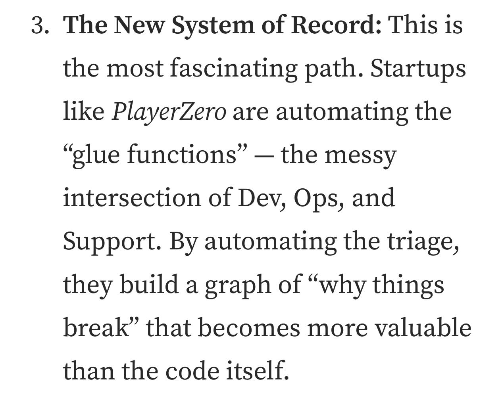

# Newsystemofrecord

> **Document Analysis:** This document has been processed through the enhanced ingest workflow with UML glossary integration and classified as a **conceptual** type (general subtype).

## Document Overview

**Source:** NewSystemOfRecord.jpg  
**Processed:** 2026-01-30 05:22:26  
**Git SHA:** a1e3cd6a168ef4053064feb0d008d9776799fd73  
**UUID7:** 132104b  
**Word Count:** 49 words  
**Main Sections:**   
**UML Classification:** conceptual (general)  

## Visual Resources

### 🎯 UML Diagram
**Type:** Conceptual Overview  
**Subtype:** general  
**File:** [Newsystemofrecord__conceptual__132104b.puml](doc/uml/Newsystemofrecord__conceptual__132104b.puml)

The UML diagram has been generated using enhanced analysis with UML glossary knowledge, providing accurate visualization of the conceptual concept described in this document.

### 📋 Technical Summary
**File:** [Newsystemofrecord__132104b.md](doc/skills/Newsystemofrecord__132104b.md)

The technical summary contains structured metadata, key insights, and AI-optimized content with UML context for automated processing.

### 📚 UML Glossary
**Reference:** [skills/uml-glossary.md](skills/uml-glossary.md)

The comprehensive UML glossary provides definitions and explanations of UML concepts, relationships, and diagram types used in this analysis.

## Key Concepts
- **The**
    - **New**
    - **System**
    - **Record**
    - **This**
    - **Startups**
    - **PlayerZero**
    - **Dev**
    - **Ops**
    - **Support**
    - **By**

## Main Takeaways

## UML Analysis Notes

This document was processed using UML glossary knowledge, enabling:
- Accurate diagram type classification
- Enhanced understanding of UML terminology
- Improved visualization based on UML standards
- Better context for technical documentation

## Original Image

    

    ## OCR Extracted Text

---

3. The New System of Record: This is the most fascinating path. Startups like PlayerZero are automating the “glue functions” — the messy intersection of Dev, Ops, and Support. By automating the triage, they build a graph of “why things break” that becomes more valuable than the code itself.
