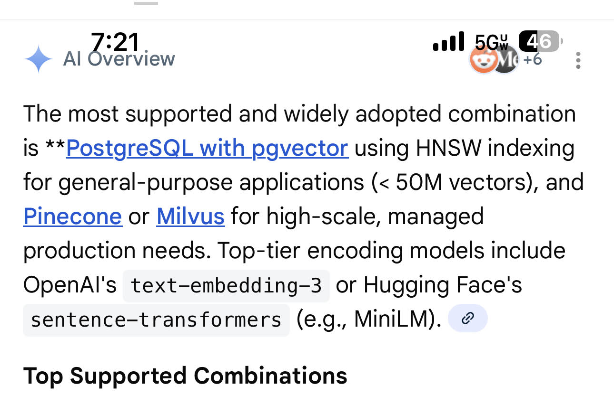

# Postgresvector

> **Document Analysis:** This document has been processed through the enhanced ingest workflow with UML glossary integration and classified as a **conceptual** type (general subtype).

## Document Overview

**Source:** PostgresVector.jpg  
**Processed:** 2026-01-30 05:22:26  
**Git SHA:** a1e3cd6a168ef4053064feb0d008d9776799fd73  
**UUID7:** c9b1356  
**Word Count:** 52 words  
**Main Sections:**   
**UML Classification:** conceptual (general)  

## Visual Resources

### 🎯 UML Diagram
**Type:** Conceptual Overview  
**Subtype:** general  
**File:** [Postgresvector__conceptual__c9b1356.puml](doc/uml/Postgresvector__conceptual__c9b1356.puml)

The UML diagram has been generated using enhanced analysis with UML glossary knowledge, providing accurate visualization of the conceptual concept described in this document.

### 📋 Technical Summary
**File:** [Postgresvector__c9b1356.md](doc/skills/Postgresvector__c9b1356.md)

The technical summary contains structured metadata, key insights, and AI-optimized content with UML context for automated processing.

### 📚 UML Glossary
**Reference:** [skills/uml-glossary.md](skills/uml-glossary.md)

The comprehensive UML glossary provides definitions and explanations of UML concepts, relationships, and diagram types used in this analysis.

## Key Concepts
- **Al**
    - **Sia**
    - **Ge**
    - **The**
    - **Pinecone**
    - **Milvus**
    - **Top**
    - **OpenAl**
    - **Hugging**
    - **Face**
    - **Supported**
    - **Combinations**

## Main Takeaways

## UML Analysis Notes

This document was processed using UML glossary knowledge, enabling:
- Accurate diagram type classification
- Enhanced understanding of UML terminology
- Improved visualization based on UML standards
- Better context for technical documentation

## Original Image

    

    ## OCR Extracted Text

---

> Al Sia thiew oll Ge : The most supported and widely adopted combination is **PostgreSQL with pgvector using HNSW indexing for general-purpose applications (< 50M vectors), and Pinecone or Milvus for high-scale, managed production needs. Top-tier encoding models include OpenAl's text-embedding-3 or Hugging Face's sentence-transformers (e.g., MiniLM). ?2 Top Supported Combinations
