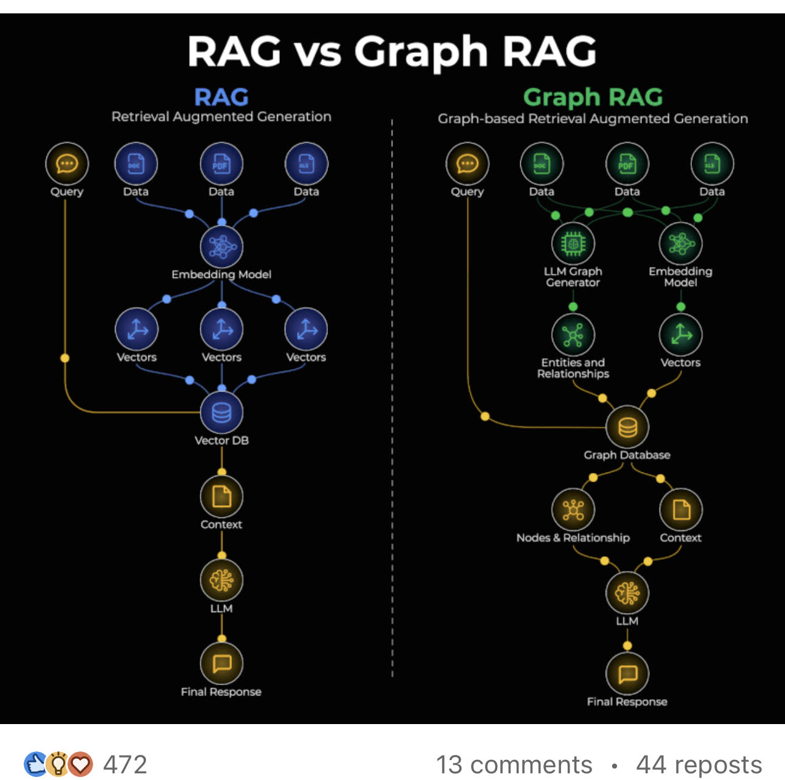

# Ragvsgraphrag

> **Document Analysis:** This document has been processed through the enhanced ingest workflow with UML glossary integration and classified as a **conceptual** type (general subtype).

## Document Overview

**Source:** RagVsGraphRag.jpg  
**Processed:** 2026-01-30 05:22:26  
**Git SHA:** a1e3cd6a168ef4053064feb0d008d9776799fd73  
**UUID7:** 4e001c4  
**Word Count:** 123 words  
**Main Sections:**   
**UML Classification:** conceptual (general)  

## Visual Resources

### 🎯 UML Diagram
**Type:** Conceptual Overview  
**Subtype:** general  
**File:** [Ragvsgraphrag__conceptual__4e001c4.puml](doc/uml/Ragvsgraphrag__conceptual__4e001c4.puml)

The UML diagram has been generated using enhanced analysis with UML glossary knowledge, providing accurate visualization of the conceptual concept described in this document.

### 📋 Technical Summary
**File:** [Ragvsgraphrag__4e001c4.md](doc/skills/Ragvsgraphrag__4e001c4.md)

The technical summary contains structured metadata, key insights, and AI-optimized content with UML context for automated processing.

### 📚 UML Glossary
**Reference:** [skills/uml-glossary.md](skills/uml-glossary.md)

The comprehensive UML glossary provides definitions and explanations of UML concepts, relationships, and diagram types used in this analysis.

## Key Concepts
- **Graph**
    - **Retrieval**
    - **Augmented**
    - **Generation**
    - **Ss**
    - **Query**
    - **Data**
    - **Naif**
    - **Embedding**
    - **Generator**
    - **Model**
    - **Vectors**
    - **Entities**
    - **Relationships**
    - **Database**
    - **Context**
    - **Nodes**
    - **Rel**
    - **Final**
    - **Response**

## Main Takeaways

## UML Analysis Notes

This document was processed using UML glossary knowledge, enabling:
- Accurate diagram type classification
- Enhanced understanding of UML terminology
- Improved visualization based on UML standards
- Better context for technical documentation

## Original Image

    

    ## OCR Extracted Text

---

RAG vs Graph RAG RAG Graph RAG Retrieval Augmented Generation Graph-based Retrieval Augmented Generation rN ; NH a @~2 @® OROMO OROMOMO \ *. Ss \ J = ' ' ' f ' ' “ SS Query Data Data Data \ Query Data Data Data —., a , eo e @ ¢ , C ' (iii fi \ 3 @ ©¢ ' \ Naif ee) ' LLM Graph Embedding ' Generator Model ' e ° (#) (p) ' \ \ ' Vectors ' h—4 pi / ' Entities and Vectors 8 1 Relationships / ' 1S pe ' ' ' I ' ' — Graph Database oN (B) wy tionship Context (#) Nodes & Rel: {as Final Response 13 comments +» 44 reposts
