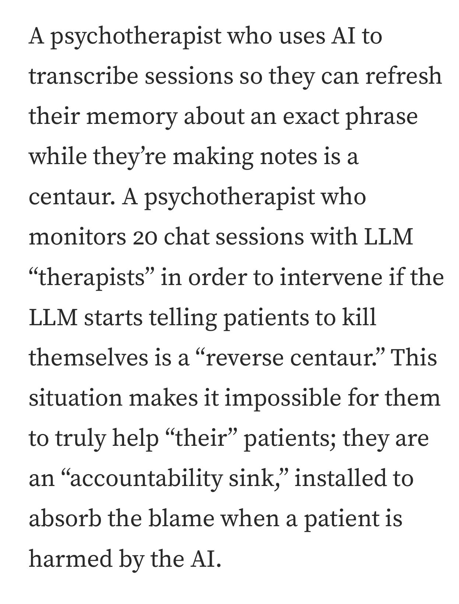

# Therapistsai

> **Document Analysis:** This document has been processed through the enhanced ingest workflow with UML glossary integration and classified as a **conceptual** type (general subtype).

## Document Overview

**Source:** TherapistsAi.jpg  
**Processed:** 2026-01-30 05:22:27  
**Git SHA:** a1e3cd6a168ef4053064feb0d008d9776799fd73  
**UUID7:** c64824c  
**Word Count:** 82 words  
**Main Sections:**   
**UML Classification:** conceptual (general)  

## Visual Resources

### 🎯 UML Diagram
**Type:** Conceptual Overview  
**Subtype:** general  
**File:** [Therapistsai__conceptual__c64824c.puml](doc/uml/Therapistsai__conceptual__c64824c.puml)

The UML diagram has been generated using enhanced analysis with UML glossary knowledge, providing accurate visualization of the conceptual concept described in this document.

### 📋 Technical Summary
**File:** [Therapistsai__c64824c.md](doc/skills/Therapistsai__c64824c.md)

The technical summary contains structured metadata, key insights, and AI-optimized content with UML context for automated processing.

### 📚 UML Glossary
**Reference:** [skills/uml-glossary.md](skills/uml-glossary.md)

The comprehensive UML glossary provides definitions and explanations of UML concepts, relationships, and diagram types used in this analysis.

## Key Concepts
- **This**

## Main Takeaways

## UML Analysis Notes

This document was processed using UML glossary knowledge, enabling:
- Accurate diagram type classification
- Enhanced understanding of UML terminology
- Improved visualization based on UML standards
- Better context for technical documentation

## Original Image

    

    ## OCR Extracted Text

---

A psychotherapist who uses AI to transcribe sessions so they can refresh their memory about an exact phrase while they’re making notes is a centaur. A psychotherapist who monitors 20 chat sessions with LLM “therapists” in order to intervene if the LLM starts telling patients to kill themselves is a “reverse centaur.” This situation makes it impossible for them to truly help “their” patients; they are an “accountability sink,” installed to absorb the blame when a patient is harmed by the AI.
