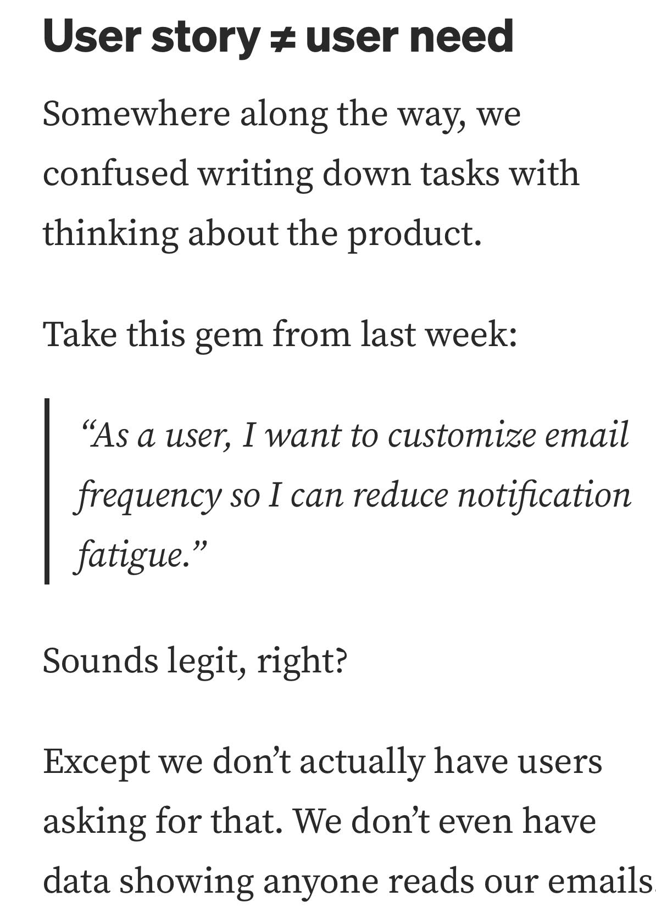

# Userstorynotuserneed

> **Document Analysis:** This document has been processed through the enhanced ingest workflow with UML glossary integration and classified as a **conceptual** type (general subtype).

## Document Overview

**Source:** UserStoryNotUserNeed.jpg  
**Processed:** 2026-01-30 05:22:27  
**Git SHA:** a1e3cd6a168ef4053064feb0d008d9776799fd73  
**UUID7:** 6fb3139  
**Word Count:** 62 words  
**Main Sections:**   
**UML Classification:** conceptual (general)  

## Visual Resources

### 🎯 UML Diagram
**Type:** Conceptual Overview  
**Subtype:** general  
**File:** [Userstorynotuserneed__conceptual__6fb3139.puml](doc/uml/Userstorynotuserneed__conceptual__6fb3139.puml)

The UML diagram has been generated using enhanced analysis with UML glossary knowledge, providing accurate visualization of the conceptual concept described in this document.

### 📋 Technical Summary
**File:** [Userstorynotuserneed__6fb3139.md](doc/skills/Userstorynotuserneed__6fb3139.md)

The technical summary contains structured metadata, key insights, and AI-optimized content with UML context for automated processing.

### 📚 UML Glossary
**Reference:** [skills/uml-glossary.md](skills/uml-glossary.md)

The comprehensive UML glossary provides definitions and explanations of UML concepts, relationships, and diagram types used in this analysis.

## Key Concepts
- **User**
    - **Somewhere**
    - **Take**
    - **As**
    - **Sounds**
    - **Except**
    - **We**

## Main Takeaways

## UML Analysis Notes

This document was processed using UML glossary knowledge, enabling:
- Accurate diagram type classification
- Enhanced understanding of UML terminology
- Improved visualization based on UML standards
- Better context for technical documentation

## Original Image

    

    ## OCR Extracted Text

---

User story # user need Somewhere along the way, we confused writing down tasks with thinking about the product. Take this gem from last week: “As a user, I want to customize email frequency so I can reduce notification fatigue.” Sounds legit, right? Except we don’t actually have users asking for that. We don’t even have data showing anyone reads our emails
