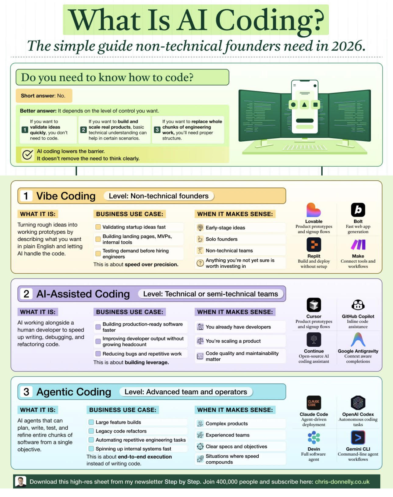

# Whatisaicoding

> **Document Analysis:** This document has been processed through the enhanced ingest workflow with UML glossary integration and classified as a **activity** type (behavioral subtype).

## Document Overview

**Source:** WhatIsAiCoding.jpg  
**Processed:** 2026-01-30 05:22:28  
**Git SHA:** a1e3cd6a168ef4053064feb0d008d9776799fd73  
**UUID7:** 78d1f21  
**Word Count:** 345 words  
**Main Sections:**   
**UML Classification:** activity (behavioral)  

## Visual Resources

### 🎯 UML Diagram
**Type:** Activity Diagram  
**Subtype:** behavioral  
**File:** [Whatisaicoding__activity__78d1f21.puml](doc/uml/Whatisaicoding__activity__78d1f21.puml)

The UML diagram has been generated using enhanced analysis with UML glossary knowledge, providing accurate visualization of the activity concept described in this document.

### 📋 Technical Summary
**File:** [Whatisaicoding__78d1f21.md](doc/skills/Whatisaicoding__78d1f21.md)

The technical summary contains structured metadata, key insights, and AI-optimized content with UML context for automated processing.

### 📚 UML Glossary
**Reference:** [skills/uml-glossary.md](skills/uml-glossary.md)

The comprehensive UML glossary provides definitions and explanations of UML concepts, relationships, and diagram types used in this analysis.

## Key Concepts
- **Better**
    - **It**
    - **Ifyou**
    - **If**
    - **By**
    - **Turning**
    - **English**
    - **Al**
    - **Validating**
    - **Building**
    - **Testing**
    - **This**
    - **Early**
    - **Solo**
    - **Non**
    - **Anything**
    - **Lovable**
    - **Product**
    - **Fast**
    - **Replit**
    - **Make**
    - **Buildand**
    - **Connect**
    - **Assisted**
    - **Coding**
    - **Technical**
    - **Improving**
    - **Reducing**
    - **You**
    - **Code**
    - **GitHub**
    - **Copilot**
    - **Inline**
    - **Cursor**
    - **Continue**
    - **Google**
    - **Antigravity**
    - **Open**
    - **Context**
    - **Agentic**
    - **Level**
    - **Advanced**
    - **Large**
    - **Legacy**
    - **Automating**
    - **Spinning**
    - **Complex**
    - **Experienced**
    - **Clear**
    - **Situations**
    - **Claude**
    - **OpenAl**
    - **Codex**
    - **Agent**
    - **Autonomous**
    - **Devin**
    - **Gemi**
    - **Lt**
    - **Fullsoftware**
    - **Command**
    - **Download**
    - **Step**
    - **Join**

## Main Takeaways

## UML Analysis Notes

This document was processed using UML glossary knowledge, enabling:
- Accurate diagram type classification
- Enhanced understanding of UML terminology
- Improved visualization based on UML standards
- Better context for technical documentation

## Original Image

    

    ## OCR Extracted Text

---

Better answer: It depends on the level of control you want. Ifyou want to. If you want to build and quickly, you don't need to code. technical understanding can help in certain scenarios. structure. If you want to replace whole validate ideas By 2c2!e real products, basic gay chunks of engineering work, you'll need proper Turning rough ideas into working prototypes by describing what you want in plain English and letting Al handle the code. © Validating startup ideas fast Building landing pages, MVPs, internal tools ip Testing demand before hiring engineers This is about speed over precision. ® Early-stage ideas ®& Solo founders 8” Non-technical teams @ Anything you're not yet sure is worth investing in Lovable Product prototypes Fast oe app and signup flows generation Replit Make Buildand deploy Connect tools and without setup workflows 2 Al-Assisted Coding _Level: Technical or semi-technical teams _) WHAT IT IS: Al working alongside a human developer to speed up writing, debugging, and refactoring code. BUSINESS USE CASE: {= Building production-ready software faster @ Improving developer output without growing headcount @ Reducing bugs and repetitive work This is about building leverage. WHEN IT MAKES SENSE: 8S You already have developers gf You're scaling a product (@ Code quality and maintainability matter & GitHub Copilot Inline code assistance Cursor Product prototypes and signup flows GO A Continue Google Antigravity Open-source AI Context aware coding assistant completions 3 Agentic Coding Level: Advanced team and operators ) WHAT IT IS: Al agents that can plan, write, test, and refine entire chunks of software from a single objective. BUSINESS USE CASE: Large feature builds Legacy code refactors Automating repetitive engineering tasks © Spinning up internal systems fast This is about end-to-end execution instead of writing code. WHEN IT MAKES SENSE: & Complex products = Experienced teams Clear specs and objectives fp Situations where speed compounds Claude Code OpenAl Codex ‘Agent-driven Autonomous coding deployment tasks se ss Devin Gemi Lt Fullsoftware Command-line agent agent workflows Download this hig! es sheet from my newsletter Step by Step. Join 41 10 people and subscril
